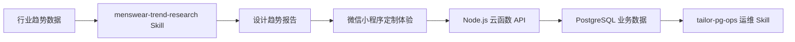

# AI × 高端男装定制 MVP

这是一个面向高端私人定制场景的 AI 落地案例。项目把行业趋势采集、微信小程序定制体验、PostgreSQL 业务运维 Skill 串成一条端到端链路，让 AI 从问答工具进入真实的设计研究、用户服务和后台运营流程。

## 项目亮点

- 行业趋势研究：通过 `menswear-trend-research` Skill 抓取 Vogue Runway、GQ、Hypebeast、中国国际时装周、Ontimeshow 等来源，并生成面向设计老师、品牌设计师和买手的高端男装趋势报告。
- 微信小程序体验：承接用户身材档案、风格偏好、AI 推荐、定制工作台、价格计算和订单确认等核心定制流程。
- 云函数业务接口：使用 Node.js 云函数统一封装用户、身材画像、风格偏好、推荐、定制选择、订单和顾问预约等业务动作。
- 数据库运维 Agent：通过 `tailor-pg-ops` Skill 将 PostgreSQL 查询和受控写操作沉淀为安全、可复用的运营动作。

## 业务链路



## 目录结构

```text
.
├── .codex/skills/
│   ├── menswear-trend-research/   # 高端男装趋势研究与爬取 Skill
│   └── tailor-pg-ops/             # PostgreSQL 业务运维 Skill
├── cloudfunctions/api/            # 云函数 API 与测试
├── db/                            # 初始化 SQL 与迁移脚本
├── docs/                          # 案例页、测试计划、部署手册与设计文档
├── miniprogram/                   # 微信小程序端页面与工具函数
└── scripts/                       # 数据库验证与 SQL 执行脚本
```

## 核心模块

| 模块 | 说明 |
|---|---|
| 身材档案 | 收集身高、体重、肩宽、胸围、腰围等定制基础信息 |
| 风格偏好 | 记录 Old Money、Quiet Luxury、商务通勤等偏好画像 |
| 推荐方案 | 根据用户画像和配置数据返回可解释的定制推荐 |
| 定制工作台 | 支持衣型、面料、颜色、工艺、顾问预约等选择 |
| 订单确认 | 汇总定制方案、价格、定金和预计交付周期 |
| 运维查询 | 查询用户、订单、画像、预约和配置数据，并支持有限 dry-run 写操作 |

## 技术栈

- WeChat Mini Program
- TypeScript / SCSS
- Node.js Cloud Function
- PostgreSQL
- Python Crawler
- Playwright
- Codex Skills
- Markdown / JSON Report

## 快速开始

### 1. 安装小程序类型依赖

```bash
npm install
```

### 2. 打开小程序

使用微信开发者工具导入项目根目录，并确认 `project.config.json` 指向当前小程序配置。小程序源码位于 `miniprogram/`。

### 3. 云函数配置

云函数位于 `cloudfunctions/api/`，部署前需要在云开发环境中配置数据库连接变量：

```env
PG_HOST=your_pg_host
PG_PORT=5432
PG_USER=your_pg_user
PG_PASSWORD=your_pg_password
PG_DATABASE=your_pg_database
PG_SSL=true
```

详细部署说明见 [cloudfunctions/api/DEPLOY.md](cloudfunctions/api/DEPLOY.md) 和 [docs/02-tcb-cloudbase-cli-使用手册.md](docs/02-tcb-cloudbase-cli-使用手册.md)。

### 4. 数据库初始化

初始化脚本位于 `db/init.sql`，迁移脚本位于 `db/migrations/`。执行生产或云端数据库操作前，请先确认环境变量来自安全位置，不要把密码写入仓库。

```bash
PG_HOST=your_pg_host PG_PORT=5432 PG_USER=your_pg_user PG_PASSWORD=your_pg_password PG_DATABASE=your_pg_database \
node scripts/verify-db.js
```

## Codex Skills

### menswear-trend-research

用于近期高端男装趋势研究、秀场/媒体/展会案例抓取、图片参考提取和设计报告生成。

```bash
python3 .codex/skills/menswear-trend-research/scripts/crawl_menswear_trends.py --days 14 --output-dir outputs
```

如需 Vogue Runway 图片参考，可在安装 Playwright 后运行：

```bash
.venv/bin/python .codex/skills/menswear-trend-research/scripts/crawl_vogue_playwright_images.py --use-system-chrome --output-dir outputs
```

### tailor-pg-ops

用于业务数据库的安全查询和受控运维动作。默认优先只读，写操作需要 dry-run 后再显式执行。

```bash
PG_HOST=your_pg_host PG_PORT=5432 PG_USER=your_pg_user PG_PASSWORD=your_pg_password PG_DATABASE=your_pg_database \
node .codex/skills/tailor-pg-ops/scripts/pg-business-actions.js list-actions
```

## 文档入口

- 案例展示页：[docs/ai-textile-case-study.html](docs/ai-textile-case-study.html)
- 云函数端到端测试计划：[docs/03-cloud-functions-e2e-test-plan.md](docs/03-cloud-functions-e2e-test-plan.md)
- 微信开发者工具手工问题清单：[docs/04-wechat-devtools-manual-bug-list.md](docs/04-wechat-devtools-manual-bug-list.md)
- 云函数部署说明：[cloudfunctions/api/DEPLOY.md](cloudfunctions/api/DEPLOY.md)

## 安全说明

- 不要将数据库密码、API Key、Token 或私钥写入源码、文档或提交历史。
- 数据库脚本应通过环境变量读取连接信息。
- `tailor-pg-ops` 的写操作必须先 dry-run，并限定目标条件。
- 生产数据库禁止执行无边界 `UPDATE`、`DELETE`、`DROP` 或 `TRUNCATE`。

## 项目价值

这个仓库不是单点 Demo，而是一个从行业知识到业务系统的可复用样板：AI 负责稳定地采集和组织趋势知识，小程序承接用户与定制流程，云函数和数据库沉淀真实业务数据，运维 Skill 再把后台查询与有限操作封装为可审计的工作流。
