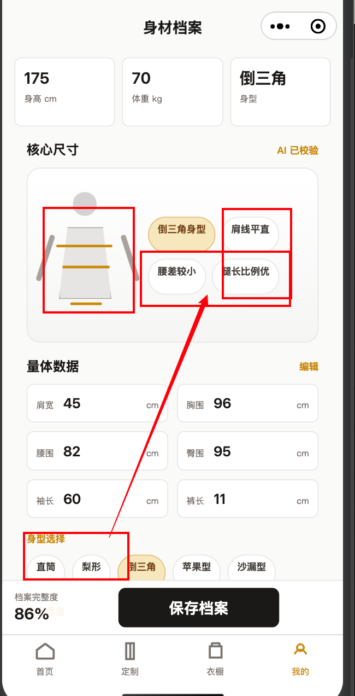
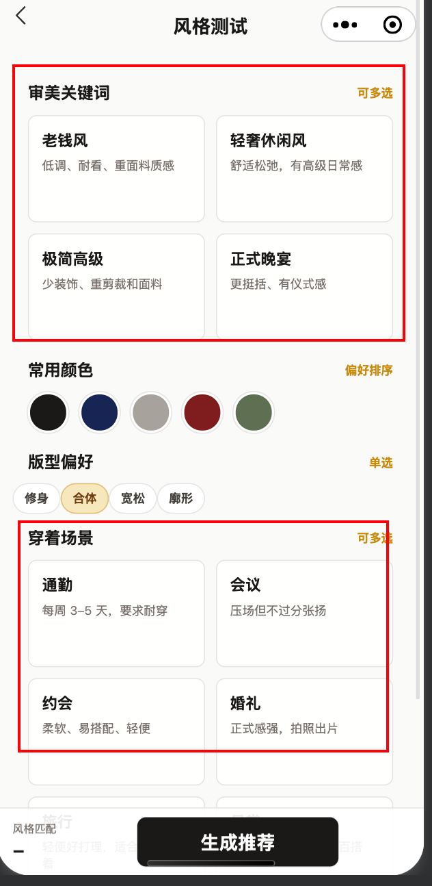
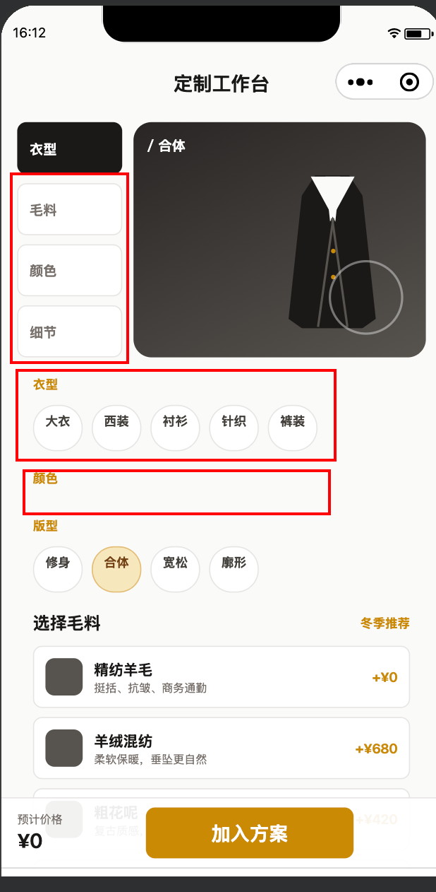
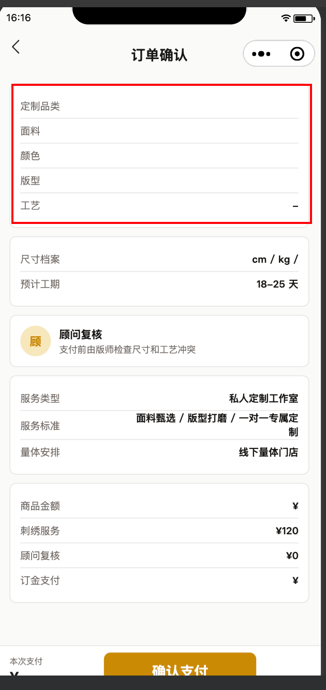

# 微信开发者工具手工测试缺陷记录

记录时间：2026-06-26 16:07 CST

本文用于记录微信开发者工具编译交互过程中发现的功能问题。后续按截图和复现信息持续追加，先记录现象，不急于一次性修复。

## BUG-001 身型选择未联动核心尺寸与示意内容

- 页面：`miniprogram/pages/profile/profile`
- 发现方式：微信开发者工具模拟器手工交互
- 严重程度：P1 功能联动错误
- 状态：已修复，待真机/模拟器完整点击流复核
- 截图：

### 复现步骤

1. 进入「我的」Tab 的「身材档案」页面。
2. 在底部「身型选择」中点击不同身型，例如从「直筒」切换到「倒三角」。
3. 观察顶部身型卡片、核心尺寸区域、人体示意图和身型特征标签。

### 实际表现

- 底部「身型选择」高亮可以变化。
- 顶部身型卡片显示为「倒三角」。
- 核心尺寸区域中的示意图和特征标签仍出现旧/不匹配内容，例如仍显示「倒三角身型」旁的标签布局未正确同步，量体数据也没有随选择更新。
- 用户感知是「点了身型，但核心尺寸这些字段没有改变」。

### 预期表现

- 切换身型后，页面所有依赖身型的数据应同步刷新。
- 至少应同步：
  - 顶部身型字段
  - 核心尺寸示意图
  - 身型特征标签
  - 与当前身型相关的推荐尺寸/展示文案
- 若量体数据本身不应自动变化，需要明确区分「用户输入的量体数据」和「身型特征说明」，避免让用户误解为数据未生效。

### 初步判断

- 可能是身型选择只更新了局部 `body_type` / 高亮状态，没有统一驱动核心尺寸卡片的数据源。
- 也可能是核心尺寸和标签使用了静态 mock 文案，没有根据当前身型重新计算或映射。

### 待确认

- 切换身型时，量体数据是否产品上应自动变化。
- 若不自动变化，核心尺寸示意区是否只展示身型特征，而非真实量体值。

### 修复记录

- 2026-06-26：统一页面字段为云函数使用的 `body_type` / `pants_length`。
- 切换身型时同步更新顶部身型字段与身型特征标签。
- 读取历史旧数据时兼容 `bodyType` / `pantsLength`。

## BUG-002 风格测试关键字与场景卡片无选择交互

- 页面：`miniprogram/pages/style-test/style-test`
- 发现方式：微信开发者工具模拟器手工交互
- 严重程度：P1 核心流程交互缺失
- 状态：已修复，待真机/模拟器完整点击流复核
- 截图：

### 复现步骤

1. 进入「风格测试」页面。
2. 在「审美关键词」区域点击任意卡片，例如「老钱风」「轻奢休闲风」。
3. 在「穿着场景」区域点击任意卡片，例如「通勤」「会议」。
4. 观察卡片状态、底部风格匹配结果和最终「生成推荐」行为。

### 实际表现

- 页面右侧文案提示「可多选」。
- 「审美关键词」和「穿着场景」卡片视觉上像可点击选项。
- 点击卡片无明显选中态、无交互反馈，也看不出数据是否被记录。
- 用户感知是「关键字、场景没有选择交互按钮，点击无反应」。

### 预期表现

- 「审美关键词」和「穿着场景」应支持多选。
- 点击后应立即显示明确选中态，例如边框高亮、背景变化、勾选标识或选中计数。
- 再次点击应可取消选择。
- 底部「风格匹配」或生成推荐所需数据应随选择同步更新。
- 点击「生成推荐」时，应把已选关键词、颜色、版型和场景一起保存为风格偏好。

### 初步判断

- 可能是 `style-test` 页面只做了静态展示，关键词和场景卡片没有绑定 `tap` 事件。
- 也可能已有数据结构但未把选中态渲染到 WXML / WXSS。

### 待确认

- 「审美关键词」最多可选几个，是否至少选 1 个。
- 「穿着场景」最多可选几个，是否影响推荐排序或只作为用户偏好保存。

### 修复记录

- 2026-06-26：关键词、颜色、场景统一使用 `preferred_styles` / `preferred_colors` / `preferred_scenes`。
- 新增选中态 map 和底部摘要刷新，点击可多选/取消。
- 读取历史旧数据时兼容 `styles` / `colors` / `scenes`。

## BUG-003 定制工作台多个选择控件不可用或报错

- 页面：`miniprogram/pages/customizer/customizer`
- 发现方式：微信开发者工具模拟器手工交互
- 严重程度：P0 核心定制流程阻塞
- 状态：已修复，待真机/模拟器完整点击流复核
- 截图：

### 复现步骤

1. 进入「定制」Tab 的「定制工作台」页面。
2. 点击左侧分段入口「毛料」「颜色」「细节」。
3. 点击「衣型」区域中的任意按钮，例如「大衣」「西装」「衬衫」。
4. 查看「颜色」区域。
5. 点击「选择毛料」列表中的任意毛料。
6. 点击「工艺细节」中的任意细节项。

### 实际表现

- 左侧「毛料」「颜色」「细节」无法作为有效切换入口使用。
- 「衣型」里点击任意按钮会报错。
- 「颜色」栏为空，没有颜色选项可选。
- 「选择毛料」点击后也会报错。
- 「工艺细节」点击后无 UI 回显，不知道是否选中。
- 页面底部「预计价格」显示为 `¥0`，与当前默认定制项不匹配。

### 预期表现

- 左侧「衣型 / 毛料 / 颜色 / 细节」应能切换到对应配置区域或滚动定位到对应区域。
- 点击衣型后，应更新当前衣型、预览标题、基础价格和可选项，不应报错。
- 颜色区域应展示可选颜色，点击后有明确选中态，并同步到预览和当前方案。
- 毛料列表点击后应更新选中毛料、价格、预览文案，不应报错。
- 工艺细节应支持多选，点击后立即显示选中态，并更新已选数量和预计价格。
- 底部预计价格应基于衣型基础价、毛料加价和细节加价实时计算。

### 初步判断

- 可能存在事件处理函数名与 WXML 绑定不一致，导致点击衣型 / 毛料时报错。
- 颜色数据可能未从配置源映射到页面 `data`，或 WXML 循环字段名不匹配。
- 工艺细节可能仅更新数据但缺少选中态 class，也可能事件没有正确写回 `data`。
- 底部价格为 `¥0` 说明默认配置未正确参与价格计算，或展示字段与实际价格字段不一致。

### 待确认

- 点击衣型和毛料时报错的控制台完整错误信息。
- 左侧「毛料」「颜色」「细节」设计上是 tab 切换，还是页内锚点滚动。
- 切换衣型后，不同衣型是否共享同一组毛料、颜色、细节选项。

### 修复记录

- 2026-06-26：定制选项统一改为 `{ code, name }` 数据结构，提交云函数时传 `garment_code` / `fabric_code` / `color_code` / `detail_codes`。
- 修复颜色选项为空、毛料/衣型点击报错、工艺细节无选中态、默认价格为 `¥0` 的问题。
- 读取历史旧中文值时自动归一化为后端 code。
- 微信开发者工具页面树已渲染出颜色区、毛料区、工艺区、已选数量和 `预计价格 ¥4740`。

## BUG-004 订单确认页顶部商品摘要为空

- 页面：`miniprogram/pages/order-confirm/order-confirm`
- 发现方式：微信开发者工具模拟器手工交互
- 严重程度：P0 下单确认信息缺失
- 状态：已修复，待真机/模拟器完整点击流复核
- 截图：

### 复现步骤

1. 从「定制工作台」进入「订单确认」页面。
2. 查看页面顶部商品摘要区域。
3. 查看费用明细区域的商品金额和订金支付金额。

### 实际表现

- 顶部商品摘要只显示字段名，没有显示具体值：
  - 定制品类为空
  - 面料为空
  - 颜色为空
  - 版型为空
  - 工艺仅显示 `-`
- 尺寸档案区域显示为 `cm / kg /`，缺少身高、体重和身型数据。
- 费用明细中「商品金额」和「订金支付」只显示 `¥`，没有金额。
- 用户无法确认即将支付的定制方案内容。

### 预期表现

- 订单确认页应完整展示从定制工作台带入的当前方案：
  - 定制品类，例如大衣
  - 面料，例如羊绒混纺
  - 颜色，例如藏蓝
  - 版型，例如合体
  - 工艺细节，例如暖金纽扣 / 半里布
- 尺寸档案应展示已保存的身高、体重和身型。
- 商品金额、刺绣服务、顾问复核和订金支付应展示完整金额。
- 若缺少必要数据，应阻止进入订单确认页，或显示明确错误/引导返回定制页。

### 初步判断

- 可能是订单确认页读取的本地 `customSelection` 字段与定制工作台实际保存字段不一致。
- 也可能是从定制工作台进入订单确认页前没有保存当前选择。
- 价格字段可能仍使用旧 mock 字段，未同步云端/本地计算后的价格。

### 待确认

- 订单确认页当前应读取本地缓存，还是直接调用云函数 `/custom-selection` 与 `/body-profile`。
- 进入订单确认页的入口是否只允许来自「加入方案」按钮。

### 修复记录

- 2026-06-26：订单页改为同时读取 `/custom-selection` 和 `/body-profile`。
- 摘要区统一把 code 映射为中文显示名，费用区展示 `priceText` / `depositText`。
- 尺寸档案改为 `profileText`，避免空对象字段导致 `cm / kg /`。
